# Домашнее задание к занятию 11 «Teamcity»

Решение ДЗ: CI/CD-конвейер на TeamCity со сборкой Java-проекта, публикацией артефакта
в Nexus и хранением конфигурации сборки в этом же репозитории (`.teamcity/settings.kts`).

Форк репозитория: [aragastmatb/example-teamcity](https://github.com/aragastmatb/example-teamcity)
→ [vpakspace/example-teamcity](https://github.com/vpakspace/example-teamcity).

---

## Содержание

- [Стенд](#стенд)
- [Подготовка к выполнению](#подготовка-к-выполнению)
- [Основная часть](#основная-часть)
- [Грабли и решения](#грабли-и-решения)
- [Как воспроизвести стенд](#как-воспроизвести-стенд)
- [Структура репозитория](#структура-репозитория)

---

## Стенд

Три виртуальные машины в Yandex Cloud (зона `ru-central1-a`, сеть `10.10.0.0/24`),
описаны в [`infra/terraform`](infra/terraform):

| ВМ | Ресурсы | Образ / роль | Внутренний IP | Внешний адрес |
|---|---|---|---|---|
| `teamcity-server` | 4 vCPU / 4 ГБ / 30 ГБ SSD | Container Optimized Image + `jetbrains/teamcity-server:2026.1.3` | 10.10.0.10 | `http://51.250.8.32:8111` |
| `teamcity-agent` | 2 vCPU / 4 ГБ / 30 ГБ SSD | Container Optimized Image + `jetbrains/teamcity-agent:2026.1.3` | 10.10.0.11 | 51.250.8.15 |
| `nexus` | 2 vCPU / 4 ГБ / 30 ГБ SSD | AlmaLinux 9 + Nexus 3.14.0-04 (playbook из ДЗ) | 10.10.0.20 | `http://46.21.244.135:8081` |

Контейнеры TeamCity подняты штатным механизмом COI — спецификацией `docker-compose`
в метаданных ВМ ([`tc-server-compose.yml`](infra/terraform/files/tc-server-compose.yml),
[`tc-agent-compose.yml`](infra/terraform/files/tc-agent-compose.yml)). Данные лежат
в именованных docker-томах, поэтому переживают перезапуск ВМ.

Security group открывает наружу 22, 8111, 8081 и ICMP, внутри группы разрешён любой трафик:
агент ходит к серверу по внутреннему адресу `http://10.10.0.10:8111`.

> Адреса в таблице приведены для протокола: стенд удалён (`terraform destroy`) сразу после
> выполнения задания, поэтому ссылки на TeamCity и Nexus сейчас не отвечают. Все результаты
> зафиксированы скриншотами в [`img/`](img) и логами в [`logs/`](logs), а стенд поднимается
> заново командами из раздела [Как воспроизвести стенд](#как-воспроизвести-стенд).

Схема потока:

```
git push → GitHub (vpakspace/example-teamcity)
                  │  VCS-триггер (опрос раз в 60 с)
                  ▼
        teamcity-server (10.10.0.10:8111)
                  │  запуск сборки
                  ▼
        teamcity-agent (10.10.0.11)
                  │  ветка master → mvn clean deploy
                  ▼
        nexus (10.10.0.20:8081) → maven-releases → plaindoll-0.0.2.jar
```

---

## Подготовка к выполнению

### 1–3. Инстансы TeamCity сервера и агента

ВМ создаются одной командой `terraform apply` (см. [Как воспроизвести стенд](#как-воспроизвести-стенд)).
Агенту переменная окружения `SERVER_URL` прописана в compose-спецификации:

```yaml
services:
  teamcity-agent:
    image: jetbrains/teamcity-agent:2026.1.3
    environment:
      SERVER_URL: "http://10.10.0.10:8111"
      AGENT_NAME: "agent-01"
```

Первичная настройка сервера: подтверждение Data Directory → внутренняя БД (HSQLDB) →
принятие лицензии → создание администратора → указание Server URL `http://51.250.8.32:8111`.

### 4. Авторизация агента

Агент подключился сам и появился в разделе Unauthorized, после авторизации — `Connected`:

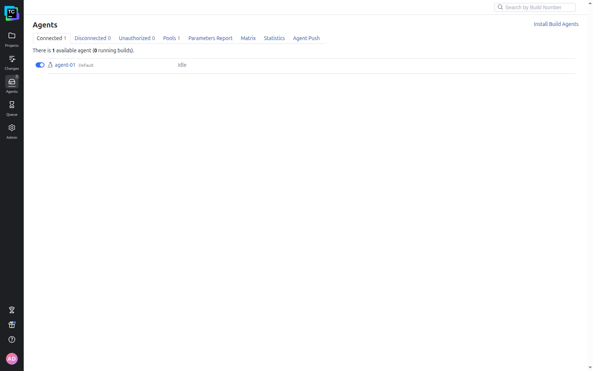

### 5. Fork репозитория

Форк сделан в [vpakspace/example-teamcity](https://github.com/vpakspace/example-teamcity).

### 6. ВМ под Nexus и запуск playbook

Playbook из ДЗ ([`infra/ansible/site.yml`](infra/ansible/site.yml)) запущен без изменений,
inventory указывает на ВМ `nexus`. Единственное дополнение — подготовительный
[`prepare.yml`](infra/ansible/prepare.yml), переводящий SELinux в permissive
(причина — в разделе [Грабли](#грабли-и-решения)).

```
PLAY RECAP *********************************************************************
nexus-01                   : ok=16   changed=1    unreachable=0    failed=0    skipped=3
```

Полный вывод: [`logs/01-ansible-nexus.log`](logs/01-ansible-nexus.log).

---

## Основная часть

### 1–2. Проект в TeamCity на основе форка + autodetect

Проект создан способом «From a repository URL», в VCS root указан форк и токен GitHub,
branch specification задан как `+:refs/heads/*` — чтобы TeamCity видел не только master:

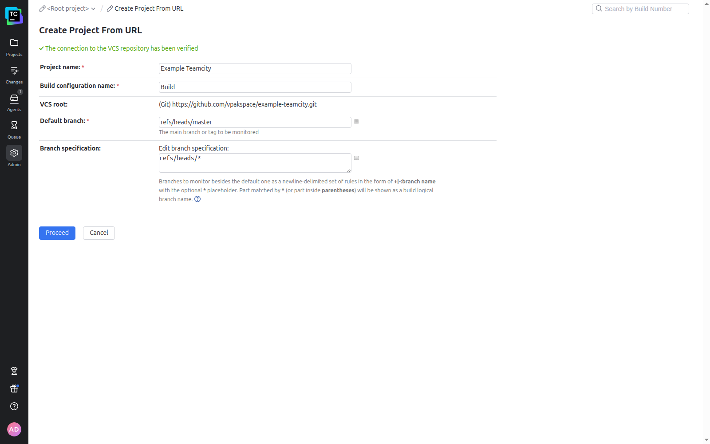

Autodetect нашёл Maven-сборку (`Path to POM: pom.xml`, `Goals: clean test`):

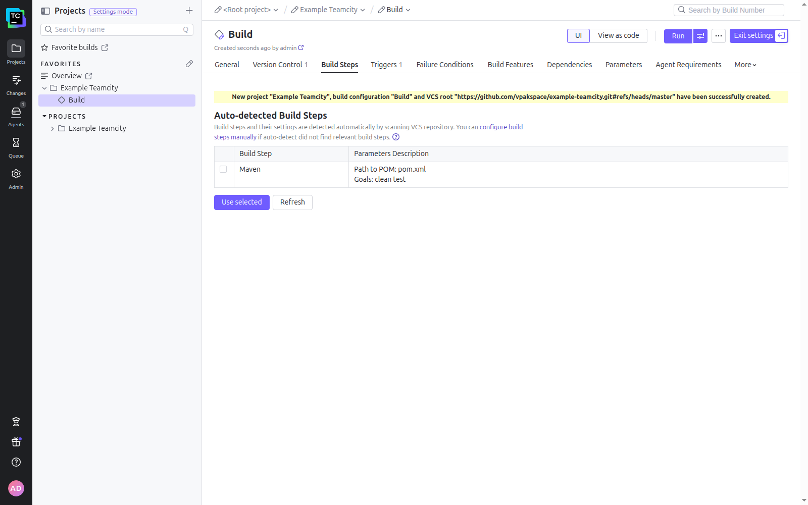

### 3. Первая сборка master

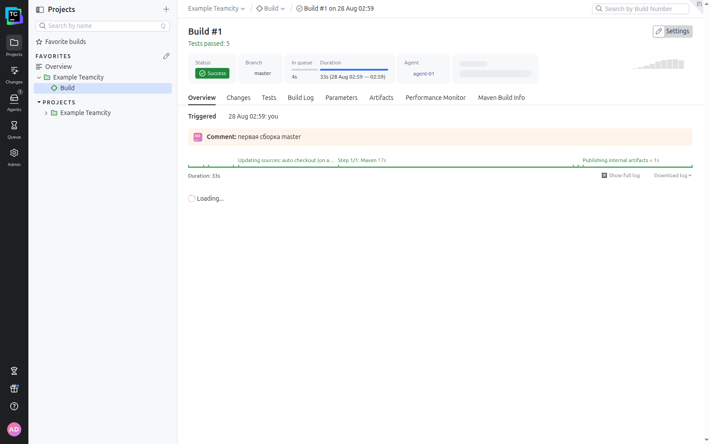

Сборка `#1` — `Tests passed: 5`.

### 4. Условия сборки: master → deploy, остальные ветки → test

Вместо одного шага сделаны два Maven-шага с parameter-based execution conditions
по параметру `teamcity.build.branch` (у дефолтной ветки его значение — `master`):

| Шаг | Goals | Условие выполнения |
|---|---|---|
| Deploy to Nexus (master) | `clean deploy` | `teamcity.build.branch equals master` |
| Test (feature branches) | `clean test` | `teamcity.build.branch does not equal master` |

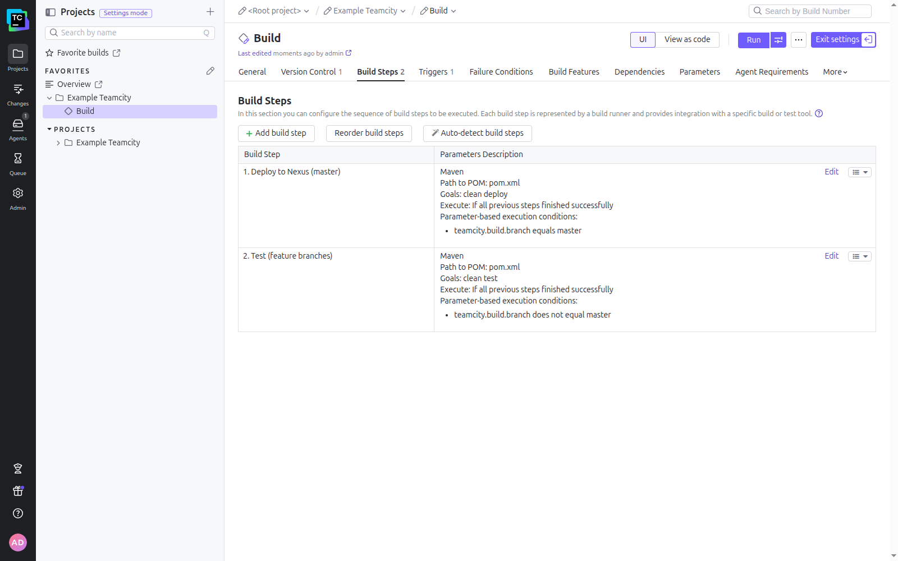

### 5. settings.xml в наборе Maven-конфигураций

Файл [`infra/settings.xml`](infra/settings.xml) (из материалов ДЗ) с кредами Nexus

```xml
<server>
  <id>nexus</id>
  <username>admin</username>
  <password>admin123</password>
</server>
```

загружен в **Project Settings → Maven Settings** под именем `nexus-settings`
и выбран в шаге deploy (`userSettingsSelection = nexus-settings`):

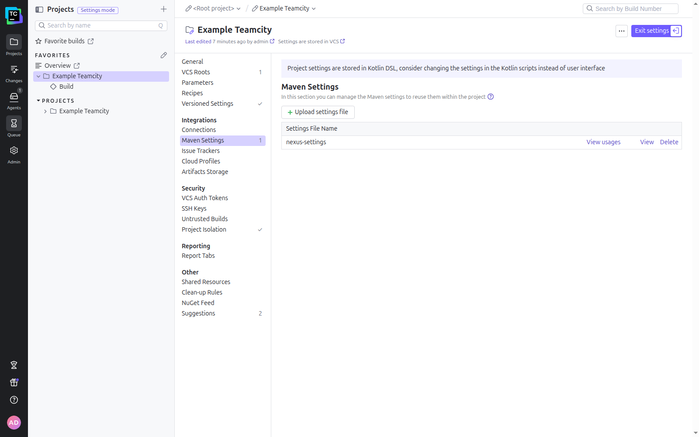

### 6. Ссылки на Nexus в pom.xml

В [`pom.xml`](pom.xml) заменён адрес репозитория на свой Nexus:

```xml
<distributionManagement>
    <repository>
        <id>nexus</id>
        <url>http://46.21.244.135:8081/repository/maven-releases</url>
    </repository>
</distributionManagement>
```

Идентификатор `nexus` совпадает с `<server><id>` в `settings.xml` — по нему Maven и подставляет креды.

В самом Nexus для `maven-releases` включена политика **Allow redeploy**: версия проекта
фиксирована (`0.0.2`), а деплой по master выполняется многократно — с политикой по умолчанию
(`Disable redeploy`) повторная публикация падала бы с `400 Bad Request`.

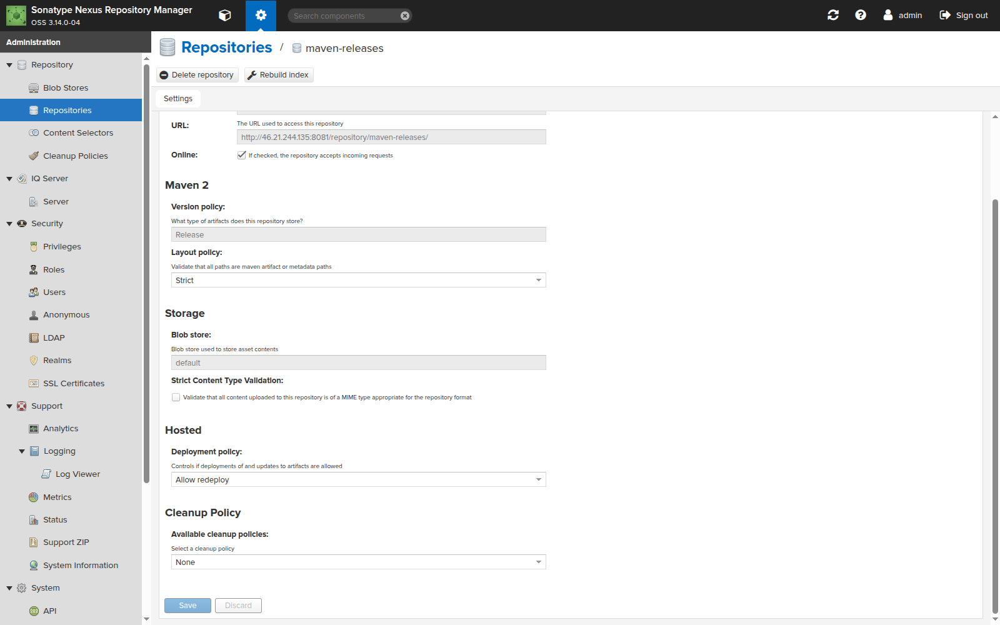

### 7. Сборка master и артефакт в Nexus

В сборке по master отработал только шаг deploy, второй шаг пропущен по условию:

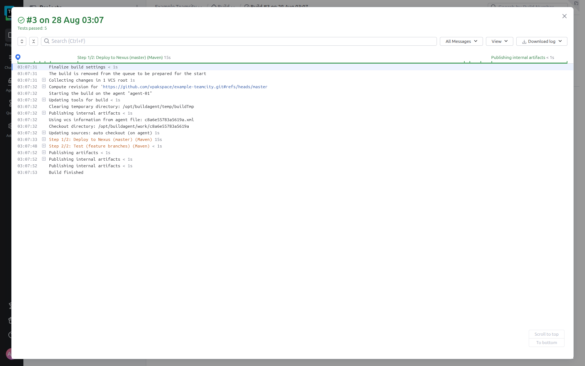

Выдержка из лога ([`logs/02-build3-master-deploy.log`](logs/02-build3-master-deploy.log)):

```
[Step 1/2] [INFO] Uploaded to nexus: http://46.21.244.135:8081/repository/maven-releases/org/netology/plaindoll/0.0.2/plaindoll-0.0.2.jar (3.1 kB at 35 kB/s)
[Step 2/2] Build step Test (feature branches) (Maven) is skipped because of unfulfilled condition
```

Артефакт в Nexus:

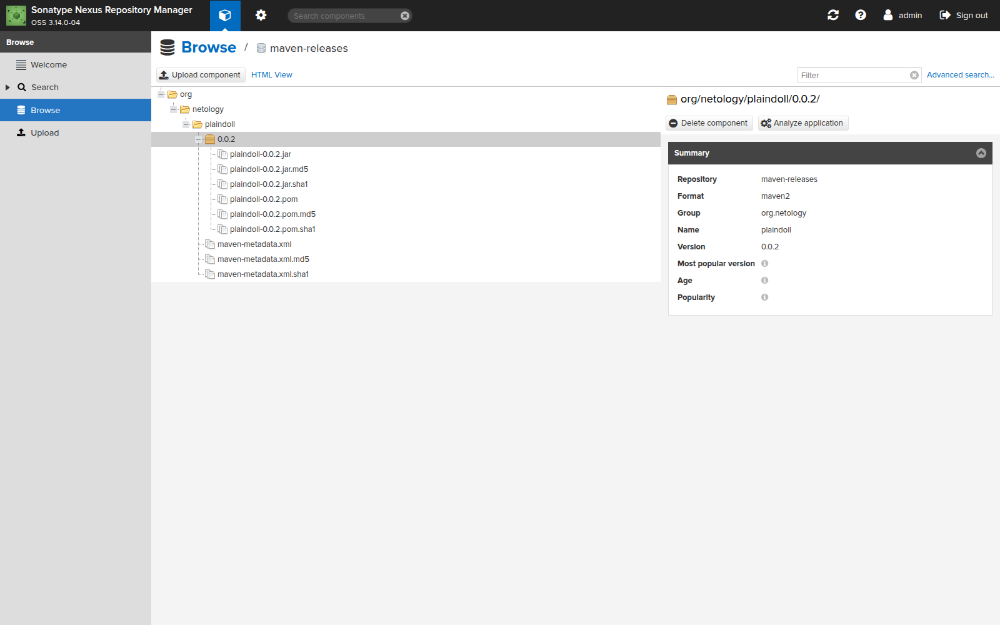

### 8. Миграция build configuration в репозиторий

Включена синхронизация **Versioned Settings** (формат Kotlin, каталог `.teamcity`,
двусторонняя синхронизация, секреты хранятся вне VCS). TeamCity закоммитил настройки
в этот же репозиторий:

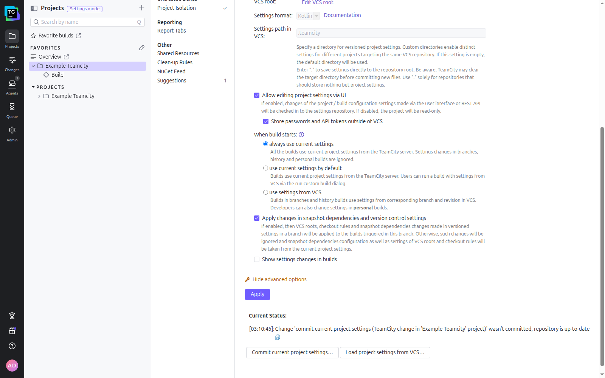

### 9–12. Ветка feature/add_reply, метод и тест

В ветке `feature/add_reply` добавлен метод в `Welcomer`:

```java
public String sayHunterReply(){
    return "Fear the old blood, good hunter, and beware the beasts of the night.";
}
```

и тест на слово `hunter`:

```java
@Test
public void welcomerSaysHunterReply() {
    assertThat(welcomer.sayHunterReply(), containsString("hunter"));
}
```

### 13. Автоматический запуск сборки по ветке

VCS-триггер (создан автодетектом вместе с проектом) сам подхватил push — сборка `#5`
запущена по событию `Triggered by: Git`, выполнен шаг тестов, deploy пропущен:

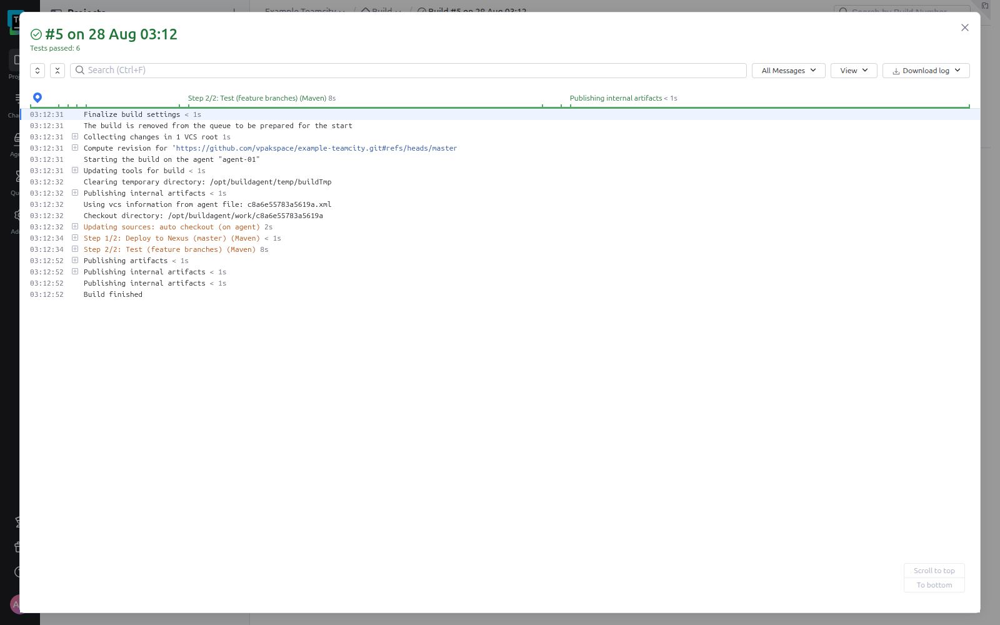

Из лога ([`logs/03-build5-feature-test.log`](logs/03-build5-feature-test.log)):

```
[Step 1/2] Build step Deploy to Nexus (master) (Maven) is skipped because of unfulfilled condition: "teamcity.build.branch equals master"
[Step 2/2] Build step condition "teamcity.build.branch does not equal master" is satisfied
[Step 2/2] [INFO] Tests run: 6, Failures: 0, Errors: 0, Skipped: 0
```

Тестов стало 6 — новый тест на `hunter` прошёл.

### 14–15. Merge в master и отсутствие артефактов

Ветка влита в master через merge-коммит (`git merge --no-ff`), сборка master запустилась
автоматически. Артефактов у сборки нет — сбор `.jar` ещё не настроен:

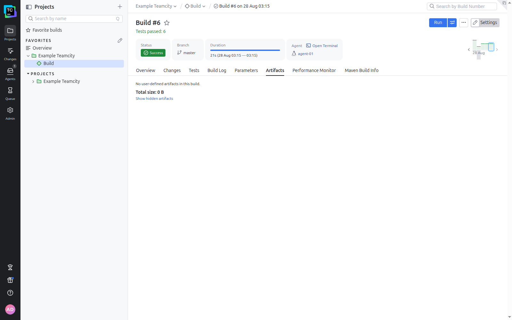

### 16–17. Сбор .jar в артефакты и повторная сборка

В конфигурации задан artifact path `target/*.jar`, после чего сборка master собрала артефакты:

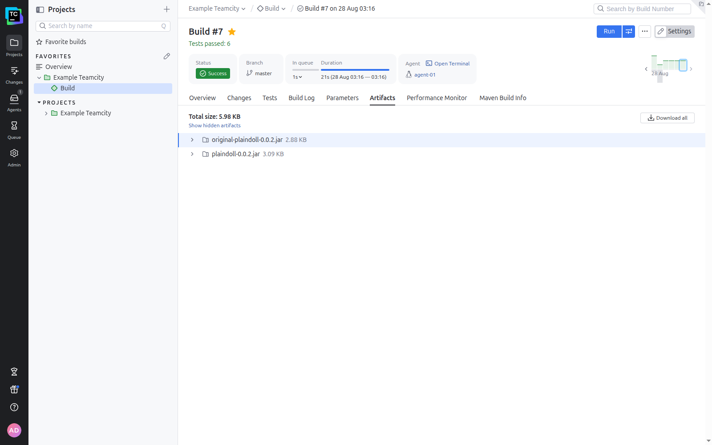

`plaindoll-0.0.2.jar` — итоговый jar (собран maven-shade-plugin),
`original-plaindoll-0.0.2.jar` — исходный jar до shade-обработки.
Лог сборки: [`logs/04-build7-master-artifacts.log`](logs/04-build7-master-artifacts.log).

Общая картина по сборкам обеих веток:

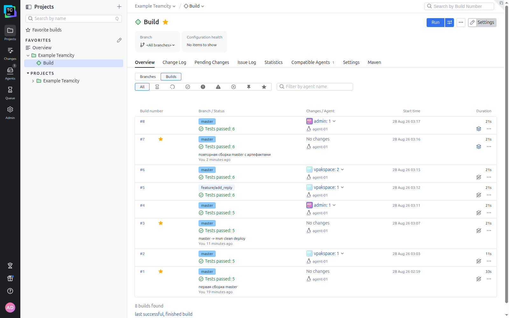

### 18. Конфигурация в репозитории содержит настройки из TeamCity

Файл [`.teamcity/settings.kts`](.teamcity/settings.kts) содержит все изменения,
сделанные в UI, — включая artifact rules, оба шага с условиями и выбранный settings.xml:

```kotlin
object Build : BuildType({
    name = "Build"

    artifactRules = "target/*.jar"

    vcs { root(DslContext.settingsRoot) }

    steps {
        maven {
            name = "Deploy to Nexus (master)"
            id = "Maven2"
            conditions { equals("teamcity.build.branch", "master") }
            goals = "clean deploy"
            runnerArgs = "-Dmaven.test.failure.ignore=true"
            userSettingsSelection = "nexus-settings"
        }
        maven {
            name = "Test (feature branches)"
            conditions { doesNotEqual("teamcity.build.branch", "master") }
            goals = "clean test"
            runnerArgs = "-Dmaven.test.failure.ignore=true"
        }
    }

    triggers { vcs {} }
})
```

---

## Грабли и решения

**Playbook из ДЗ ставит Nexus в `/home/nexus`, а SELinux на EL9 это запрещает.**
Сервис падал с `Failed to locate executable /home/nexus/nexus/bin/nexus: Permission denied`
(`status=203/EXEC`): systemd не может запускать бинарники из домашних каталогов, пока действует
политика targeted. Playbook из ДЗ править не хотелось, поэтому добавлен отдельный
[`prepare.yml`](infra/ansible/prepare.yml), переводящий SELinux в permissive.

**AlmaLinux 8 не подошёл под ansible-core 2.20.** В образе есть только `platform-python` 3.6,
с которым современный ansible-core не работает, а поставить свежий Python и не сломать модуль
`dnf` (он привязан к системному интерпретатору) нельзя. Взят AlmaLinux 9: там `/usr/bin/python3`
это 3.9, а нужный playbook'у `java-1.8.0-openjdk` в репозиториях присутствует.

**Пользователи по умолчанию в образах YC различаются.** В Container Optimized Image это `ubuntu`,
в AlmaLinux — `almalinux`, а не `yc-user`, как в большинстве образов. Диагностируется по выводу
`yc compute instance get-serial-port-output`, где cloud-init печатает, в чей `authorized_keys`
положен ключ.

**Часть внешних адресов YC недоступна из моей сети.** У ВМ, получивших адреса `84.252.*`
и `51.250.6.*`, снаружи не открывался ни один TCP-порт, хотя ICMP проходил, а изнутри облака
те же порты отвечали. Лечится сменой адреса: зарезервированы статические адреса, ВМ переведены
на `51.250.8.32` и `46.21.244.135` — они доступны. Пока адрес подбирался, Ansible ходил на
Nexus через `ProxyJump` до рабочей ВМ.

**COI не смог скачать образ TeamCity с первой попытки.** `yc-container-daemon` несколько раз
падал с `Get "https://registry-1.docker.io/v2/": Client.Timeout exceeded`; помог ручной
`docker pull` и перезапуск демона. Агент при этом скачался сразу.

**Оператор условия в REST API называется `DOES_NOT_EQUAL`.** Условия шага хранятся в свойстве
`teamcity.step.conditions` в виде JSON: `[["EQUALS","teamcity.build.branch","master"]]`.
Значение `NOT_EQUALS`, которое напрашивается, TeamCity не понимает — страница Build Steps
после такой записи отдавала `500 Unexpected Error`.

---

## Как воспроизвести стенд

```bash
# 1. Инфраструктура (нужен authorized key сервисного аккаунта в ~/.authorized_key.json)
cd infra/terraform
terraform init
terraform apply          # выведет адреса всех трёх ВМ

# 2. Nexus (подставить внешний адрес ВМ nexus в inventory)
cd ../ansible
vim inventory/cicd/hosts.yml
ansible-playbook prepare.yml     # SELinux → permissive
ansible-playbook site.yml        # playbook из ДЗ, ставит Nexus 3.14

# 3. TeamCity — первичная настройка в браузере: http://<teamcity-server>:8111
#    БД: Internal (HSQLDB) → лицензия → администратор → Server URL
#    Агент авторизуется в разделе Agents → Unauthorized

# 4. Удалить стенд
cd ../terraform && terraform destroy
```

---

## Структура репозитория

```
.teamcity/settings.kts      конфигурация сборки, синхронизируется TeamCity (Versioned Settings)
pom.xml                     проект, distributionManagement указывает на свой Nexus
src/                        Welcomer + тесты (добавлен метод и тест на слово hunter)
infra/terraform/            3 ВМ, сеть, security group, статические адреса
infra/ansible/              playbook из ДЗ + prepare.yml (SELinux)
infra/settings.xml          maven settings с кредами Nexus (загружается в TeamCity)
img/                        скриншоты
logs/                       логи установки Nexus и ключевых сборок
```
